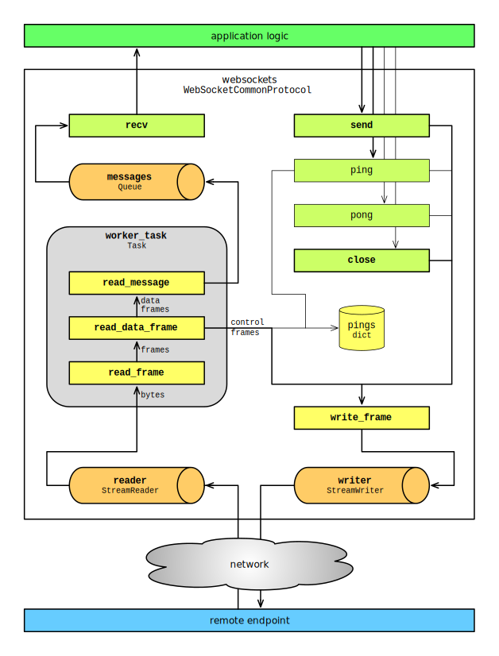

Design
======

This document describes the design of websockets. It's primarily intended at
maintainers. It may also be useful for users who wish to understand the effect
of configuration settings.

.. warning:

    Internals described in this document may change at any time.

    Backwards compatibility is only guaranteed for `public APIs <api>`_.

Opening handshake
-----------------

TODO

Data transfer
-------------

Symmetry
........

Once the opening handshake has completed, the WebSocket protocol is almost
symmetrical. There are two small differences between a server and a client:

- `client-to-server masking`_: the client masks outgoing frames; the server
  unmasks incoming frames;
- `closing the TCP connection`_: the server closes the connection immediately;
  the client expects the server to do it.

.. _client-to-server masking: https://tools.ietf.org/html/rfc6455#section-5.3
.. _closing the TCP connection: https://tools.ietf.org/html/rfc6455#section-5.5.1

These differences are so minor that all the logic for `data framing`_, for
`sending and receiving data`_ and for `closing the connection`_ is implemented
in the same class, :class:`~websockets.protocol.WebSocketCommonProtocol`.

.. _data framing: https://tools.ietf.org/html/rfc6455#section-5
.. _sending and receiving data: https://tools.ietf.org/html/rfc6455#section-6
.. _closing the connection: https://tools.ietf.org/html/rfc6455#section-7

The :attr:`~websockets.protocol.WebSocketCommonProtocol.is_client` attribute
tells which side a protocol instance is managing. This attribute is defined on
the :attr:`~websockets.protocol.WebSocketServerProtocol` and
:attr:`~websockets.protocol.WebSocketClientProtocol` classes.

Data flow
.........

The following diagram shows how data flows between an application built on top
of ``websockets`` and a remote endpoint. Given the symmetry explained above,
it applies regardless of which side is the server or the client.

Public methods are shown in green, private methods in yellow, and buffers in
orange. Methods related to connection termination are omitted; connection
termination is discussed in another section below.

Receiving data
..............

The left side of the diagram shows how ``websockets`` receives data.

Incoming data is written to a :class:`~asyncio.StreamReader` in order to
implement flow control and provide backpressure easily.

When the TCP connection is established, ``websockets`` starts a
:class:`~asyncio.Task` which executes ``WebSocketCommonProtocol.run()``. This
task runs in the background until the connection is closed. It processes
incoming frames and makes messages available for the application. The
:attr:`~websockets.protocol.WebSocketCommonProtocol.worker_task` attribute
stores a reference to this task in order to handle its termination properly.

From the moment the opening handshake completes and until the closing
handshake completes, the worker task reads incoming frames from the
connection. When it encounters a control frame:

- if it's a close frame, it starts the closing handshake;
- if it's a ping frame, it anwsers with a pong frame;
- if it's a pong frame, it acknowledges the corresponding ping (unless it's an
  unsolicited pong).

When it receives data frames, the worker frame reassembles fragments and puts
the resulting message in the messages queue.

Running this process in a task guarantees that control frames are processed
promptly. Without such a task, ``websockets`` would depend on the application
to drive the connection by having exactly one coroutine awaiting
:meth:`~websockets.protocol.WebSocketCommonProtocol.recv` at any time. While
this happens naturally in many use cases, it cannot be relied upon.

:meth:`~websockets.protocol.WebSocketCommonProtocol.recv` fetches the next
message from the messages queue (with some complexity added for handling
termination correctly).

Sending data
............

The left side of the diagram shows how ``websockets`` sends data.

:meth:`~websockets.protocol.WebSocketCommonProtocol.send` writes a single data
frame containing the message. Fragmentation isn't supported now.

:meth:`~websockets.protocol.WebSocketCommonProtocol.ping` writes a ping frame
and waits for the corresponding pong frame.

:meth:`~websockets.protocol.WebSocketCommonProtocol.pong` writes a pong frame.

:meth:`~websockets.protocol.WebSocketCommonProtocol.close` writes a close
frame and waits for the connection to terminate.

Outgoing data is written to a :class:`~asyncio.StreamWriter` in order to
implement flow control and provide backpressure easily.

Connection termination
----------------------

TODO

Cancellation
------------

TODO

.. _backpressure:

Backpressure
------------

.. note::

    This section discusses backpressure from the perspective of a server but
    the concept applies to clients symmetrically.

With a naive implementation, if a server receives inputs faster than it can
process them, or if it generates outputs faster than it can send them, data
accumulates in buffers, eventually causing the server to run out of memory and
crash.

The solution to this problem is backpressure. Any part of the server that
receives inputs faster than it can it can process them and send the outputs
must propagate that information back to the previous part in the chain.

``websockets`` is designed to make it easy to get backpressure right.

For incoming data, ``websockets`` builds upon :class:`~asyncio.StreamReader`
which propagates backpressure to its own buffer and to the TCP stream. Frames
are parsed from the input stream and added to a bounded queue. If the queue
fills up, parsing halts until some the application reads a frame.

For outgoing data, ``websockets`` builds upon :class:`~asyncio.StreamWriter`
which implements flow control. If the output buffers grow too large, it waits
until they're drained. That's why all APIs that write frames are asynchronous.

Of course, it's still possible for an application to create its own unbounded
buffers and break the backpressure. Be careful with queues.

.. _buffers:

Buffers
-------

An asynchronous systems works best when its buffers are almost always empty.

For example, if a client sends data too fast for a server, the queue of
incoming messages will be constantly full. The server will always be 32
messages (by default) behind the client. This consumes memory and increases
latency for no good reason.

If buffers are almost always full and that problem cannot be solved by adding
capacity (typically because the system is bottlenecked by the output and
constantly regulated by backpressure), reducing the size of buffers minimizes
negative consequences.

By default ``websockets`` has rather high limits. You can decrease them
according to your application's characteristics.

Bufferbloat can happen at every level in the stack where there is a buffer.
For each connection, the receiving side contains these buffers:

- OS buffers: you shouldn't need to tune them in general.
- :class:`~asyncio.StreamReader` bytes buffer: the default limit is 64kB.
  You can set another limit by passing a ``read_limit`` keyword argument to
  :func:`~websockets.client.connect` or :func:`~websockets.server.serve`.
- Incoming messages :class:`~asyncio.queues.Queue`: its size depends both on
  the size and the number of messages it contains. By default the maximum
  UTF-8 encoded size is 1MB and the maximum number is 32. In the worst case,
  after UTF-8 decoding, a single message could take up to 4MB of memory and
  the overall memory consumption could reach 128MB. You can adjust these
  limits by setting the ``max_size`` and ``max_queue`` keyword arguments of
  :func:`~websockets.client.connect` or :func:`~websockets.server.serve`.

For each connection, the sending side contains these buffers:

- :class:`~asyncio.StreamWriter` bytes buffer: the default size is 64kB.
  You can set another limit by passing a ``write_limit`` keyword argument to
  :func:`~websockets.client.connect` or :func:`~websockets.server.serve`.
- OS buffers: you shouldn't need to tune them in general.

